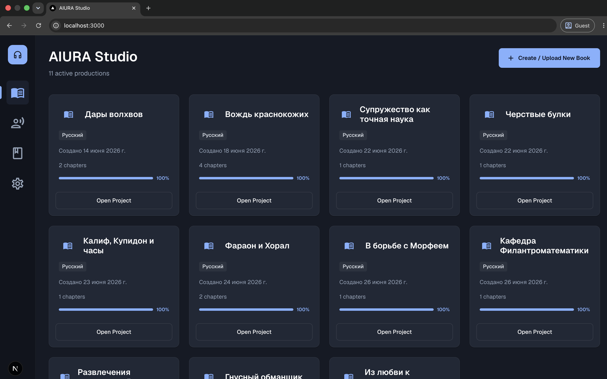
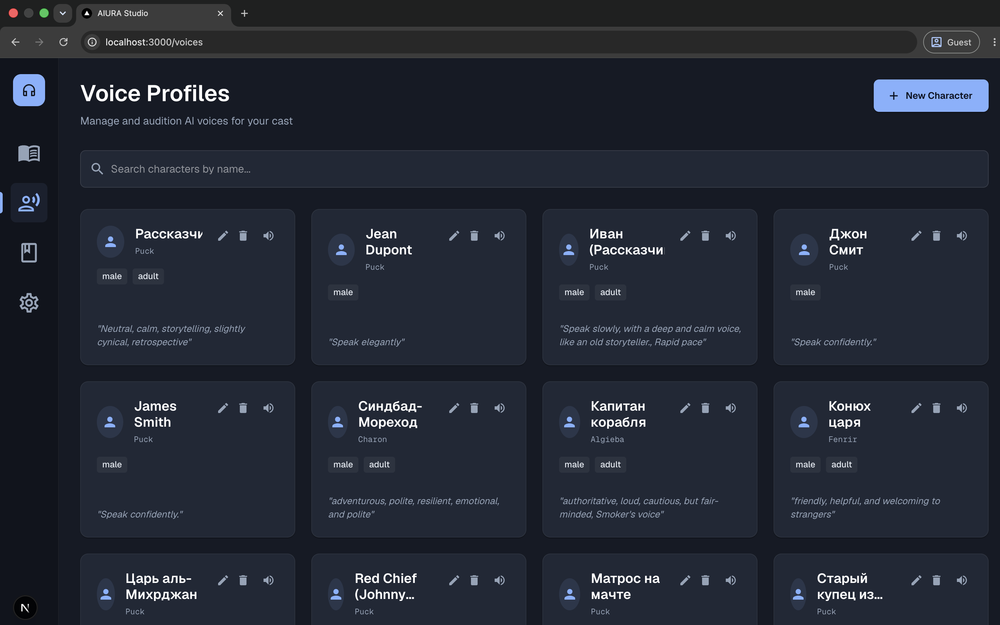
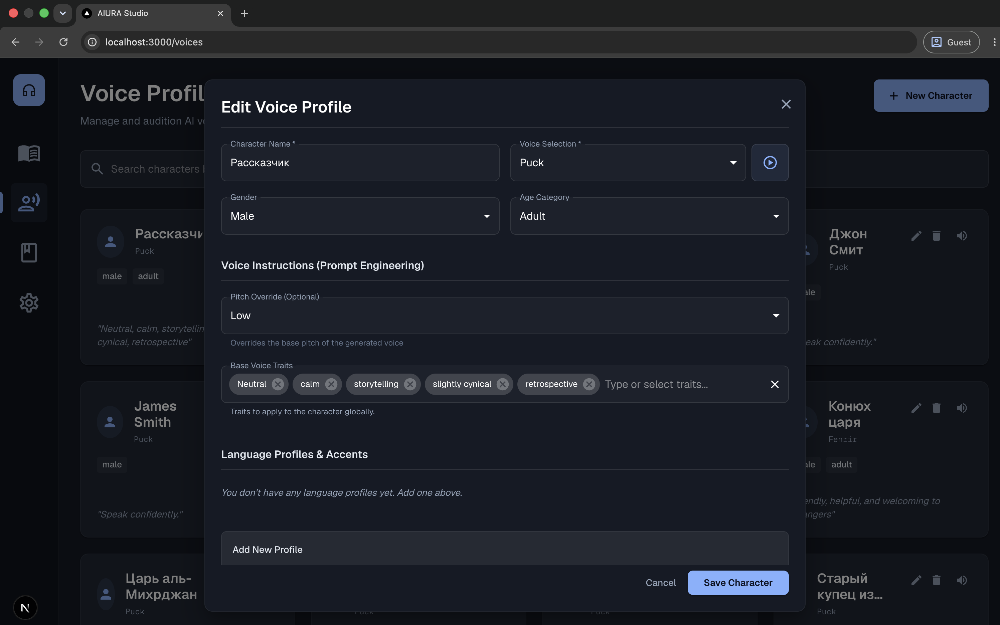
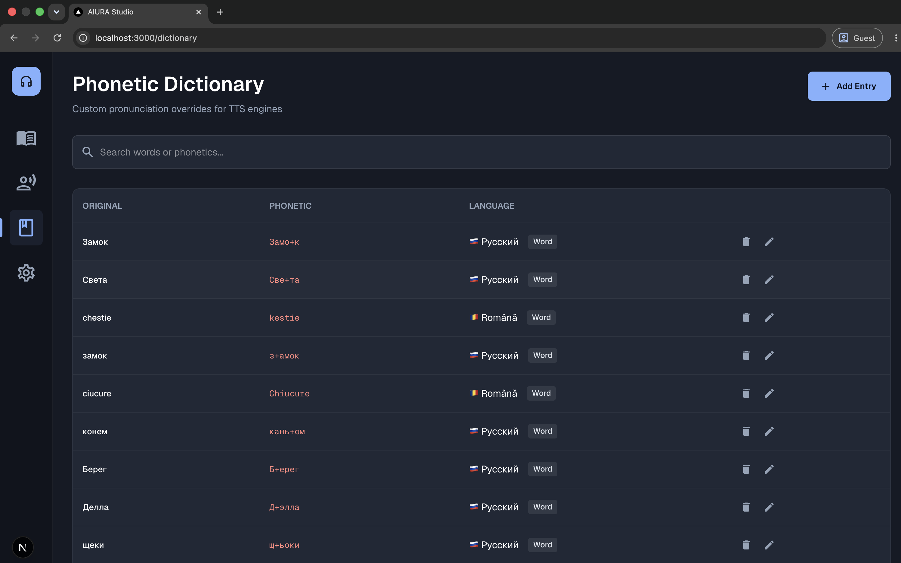
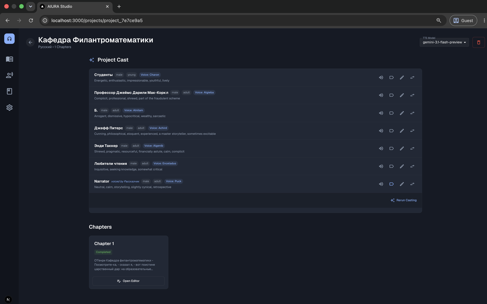
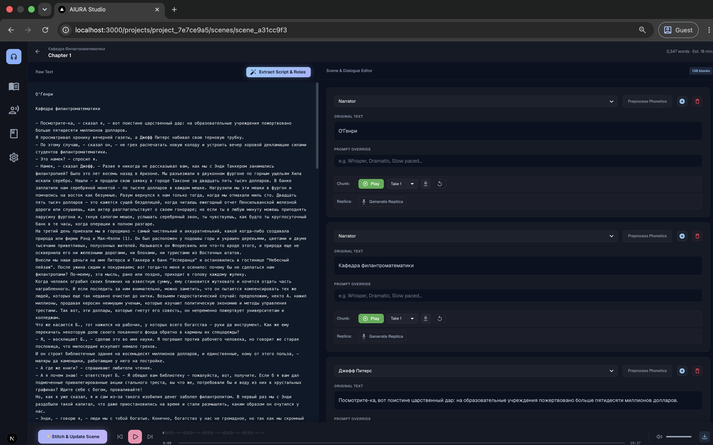
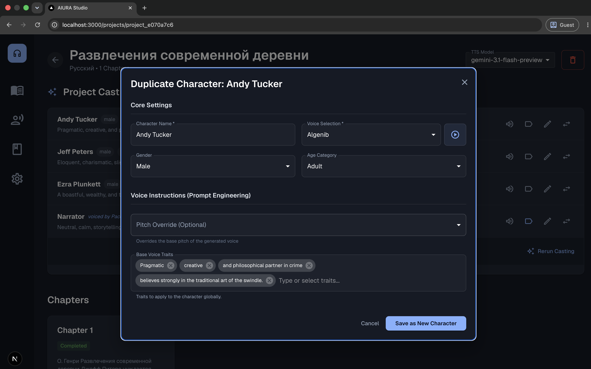

# AIURA Production Studio

AIURA Production Studio is a premium, AI-powered casting, editing, and voice-generation workshop designed for audiobooks, video localization, and movie dubbing. It uses a Next.js frontend and a FastAPI backend to coordinate multi-character speech synthesis via the Gemini TTS API.

---

## 📸 Screenshots Showcase

<p align="center">
  
  
</p>
<p align="center">
  
  
</p>
<p align="center">
  
  
</p>
<p align="center">
  
</p>

---

## 🎧 Created Audiobooks Showcase
Check out actual audiobooks and sample tracks fully produced using AIURA Production Studio on our YouTube channel:
👉 **[AIURA Production Studio Showcase on YouTube](https://www.youtube.com/channel/UCkNHE4zeaFT6eJsyO2k8Mqg)**

---

## 🚀 Quick Start (Docker Compose)

The easiest way to run the entire AIURA Production Studio stack (frontend & backend) is using Docker Compose.

### Prerequisites
- [Docker](https://www.docker.com/) and Docker Compose installed.

### Setup & Run
1. (Optional) If you have existing projects or want to store audio in a custom directory on your host machine, create a `.env` file in this root folder and set your path:
   ```env
   AUDIOBOOKS_ROOT_PATH=/Users/yourname/Desktop/ProjectBooks
   ```
   *If not specified, Docker will default to creating a `./data` directory in the project root.*
2. Start the entire application stack:
   ```bash
   docker-compose up --build
   ```
3. Open your browser and navigate to:
   * **Frontend Panel**: [http://localhost:3000](http://localhost:3000)
   * **Backend API Docs**: [http://localhost:8000/docs](http://localhost:8000/docs)

---

## 🛠 Project Structure

- [audiobook-client/](file:///Users/iuriyrusanovskiy/Desktop/AudioBooks/audiobook-client) — React & Next.js 15 frontend application.
- [audiobook-tts/](file:///Users/iuriyrusanovskiy/Desktop/AudioBooks/audiobook-tts) — FastAPI backend engine.
- [docker-compose.yml](file:///Users/iuriyrusanovskiy/Desktop/AudioBooks/docker-compose.yml) — Docker container orchestration.

---

## 📦 Manual Installation (Without Docker)

If you prefer to run the components separately:

### 1. Backend Engine
Go to `audiobook-tts/` and read the [Backend README](file:///Users/iuriyrusanovskiy/Desktop/AudioBooks/audiobook-tts/README.md) for full Python & FFmpeg setup instructions.
```bash
cd audiobook-tts
uv sync
uv run alembic upgrade head
uv run uvicorn main:app --reload --reload-exclude '*.db'
```

### 2. Frontend Client
Go to `audiobook-client/` and read the [Frontend README](file:///Users/iuriyrusanovskiy/Desktop/AudioBooks/audiobook-client/README.md) for details.
```bash
cd audiobook-client
pnpm install
pnpm run dev
```

---

## 🔮 Future Roadmap & Alternative Use Cases

AIURA Production Studio's core casting engine and dialogue-based line editor are highly extensible and naturally adapt to other media formats:

### 🎬 Movie Dubbing & Video Translation
* **Concept**: Import subtitle files (e.g., `.srt`, `.ass`) instead of books.
* **Timeline Binding**: Bind generated voice replica clips directly to subtitle timestamp ranges.
* **Orchestration**: Assign different voice actors to subtitle blocks matching specific characters to auto-generate multi-voice localized voiceovers.

### 🎮 Video Game Localization & Dialog Voicing
* **Concept**: Connect the casting engine to game dialogue localization spreadsheets.
* **Batch Generation**: Bulk-generate all game character replica takes using voice IDs mapped to localization keys.
* **Quality Check**: Audition and review lines directly inside the take selector UI to tweak tone and stress marks before exporting to the game engine.
* **Agent Spec**: See the full implementation specification in [agent_spec_localization.md](file:///Users/iuriyrusanovskiy/Desktop/AudioBooks/audiobook-client/docs/agent_spec_localization.md).

---

## ⚖️ License & Security

### License
AIURA Production Studio is distributed under the MIT License. The software is designed to be run entirely on the user's local machine, providing full privacy and database ownership.

### Gemini API Compliance
This studio uses the Google Gemini API for text processing and speech synthesis. Users must ensure that their API usage and generated audio files comply with the Google Gemini Terms of Service and safety policies.

### Security & Privacy
* **Self-Custody of Keys**: Your Gemini API keys are encrypted and saved **solely inside your local SQLite database** on your computer.
* **Full Data Ownership**: No project structures, voice configurations, or generated audio files are ever collected, uploaded, or transmitted to any third-party servers (except direct, secure API requests sent to Google Gemini endpoints). You are fully responsible for the protection and backup of your local database and API keys.
